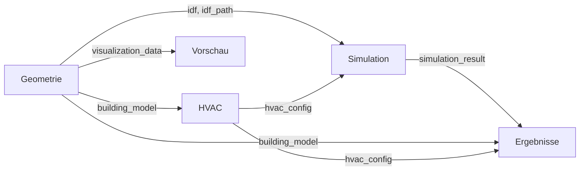

# 01 - Web UI Dokumentation

> **Modul:** Streamlit Web-Interface
> **Dateien:** `features/web_ui/pages/*.py`
> **Zuletzt aktualisiert:** 2025-11-14

---

## Übersicht

Die Web UI besteht aus **4 Hauptseiten** die einen sequenziellen Workflow abbilden:

```
01_Geometrie.py  →  02_HVAC.py  →  03_Simulation.py  →  04_Ergebnisse.py
     (Input)         (Config)        (Execute)           (Output)
```

---

## Seite 01: Geometrie (01_Geometrie.py)

### Zweck
Geometrie-Definition mit **zwei alternativen Eingabemethoden**:
1. **SimpleBox** - Einfache parametrische Eingabe
2. **Energieausweis** - Detaillierte OIB RL6 12.2-konforme Eingabe

### Tab-Struktur

```
├── Tab 1: Einfache Eingabe (SimpleBox)
├── Tab 2: Energieausweis (OIB RL6 12.2)
└── Tab 3: Vorschau (3D-Visualisierung)
```

---

### TAB 1: Einfache Eingabe (SimpleBox)

#### Input-Widgets

| Widget | Typ | Default | Range | Einheit | Beschreibung |
|--------|-----|---------|-------|---------|--------------|
| `length` | slider | 20.0 | 5.0-100.0 | m | Gebäudelänge |
| `width` | slider | 12.0 | 5.0-100.0 | m | Gebäudebreite |
| `height` | slider | 6.0 | 3.0-100.0 | m | Gesamthöhe |
| `num_floors` | number_input | 2 | 1-20 | - | Anzahl Stockwerke |
| `window_wall_ratio` | slider | 0.3 | 0.0-0.9 | - | Fensterflächenanteil |
| `orientation` | slider | 0 | 0-359 | ° | Gebäudeorientierung (Nord=0) |

#### Auto-Berechnungen

```python
floor_height = height / num_floors  # Automatische Stockwerkshöhe
floor_area = length * width         # Grundfläche pro Geschoss
total_floor_area = floor_area * num_floors
```

#### Backend-Funktionen

**Button: "Geometrie erstellen"**

```python
from core.building_model import BuildingModel

building_model = BuildingModel.from_simplebox(
    length=length,
    width=width,
    height=height,
    num_floors=num_floors,
    floor_height=floor_height,
    window_wall_ratio=window_wall_ratio,
    idf_path=None  # Wird bei Simulation erstellt
)
```

#### Session State Output

```python
st.session_state['building_model'] = building_model.model_dump()
st.session_state['geometry_method'] = 'simplebox'
st.session_state['geometry_valid'] = True
st.session_state['visualization_data'] = {
    'length': length,
    'width': width,
    'height': height,
    'num_floors': num_floors,
    'floor_area': floor_area,
    'window_wall_ratio': window_wall_ratio
}
```

---

### TAB 2: Energieausweis (OIB RL6 12.2)

Dieser Tab ist in **2 Phasen** unterteilt:

#### PHASE 1: OIB 12.2 Pflichtangaben

##### Spalte 1: Gebäudedaten

| Feld | Widget | Default | Einheit | Beschreibung |
|------|--------|---------|---------|--------------|
| `gebaeudetyp` | selectbox | EFH | - | EFH/MFH/NWG |
| `bruttoflaeche` | number_input | 219.0 | m² | Brutto-Grundfläche |
| `bezugsflaeche` | number_input | 175.0 | m² | Netto-Grundfläche (beheizt) |
| `brutto_volumen` | number_input | 729.0 | m³ | Brutto-Volumen |
| `huellflaeche_gesamt` | number_input | 538.0 | m² | Hüllfläche gesamt |
| `u_wand` | number_input | 0.35 | W/m²K | U-Wert Außenwand |
| `u_dach` | number_input | 0.25 | W/m²K | U-Wert Dach |
| `u_boden` | number_input | 0.45 | W/m²K | U-Wert Bodenplatte |
| `u_fenster` | number_input | 1.5 | W/m²K | U-Wert Fenster |
| `bauweise` | selectbox | Massiv | - | Massiv/Leicht |

##### Spalte 2: Klimadaten & Systeme

| Feld | Widget | Default | Einheit | Beschreibung |
|------|--------|---------|---------|--------------|
| `klima_quelle` | radio | Datenbank | - | Datenbank/EPW/Manuell |
| `plz_input` | number_input | 1010 | - | PLZ für Klimadaten-Lookup |
| `klimaregion` | selectbox | Ost | - | Ost/West/Süd/Nord (wenn manuell) |
| `heizgradtage` | number_input | 3400.0 | Kd | Heizgradtage (20°C Heizgrenze) |
| `heiztage` | number_input | 220 | d | Anzahl Heiztage |
| `norm_aussentemp` | number_input | -12.0 | °C | Norm-Außentemperatur |
| `art_lueftung` | selectbox | Fensterlüftung | - | Lüftungsart |
| `soll_innentemp` | number_input | 20.0 | °C | Soll-Innentemperatur |

**Klimadaten-Lookup:**
```python
from core.climate_data import get_climate_data_by_plz

if klima_quelle == "Datenbank":
    climate_data = get_climate_data_by_plz(plz_input)
    if climate_data:
        heizgradtage = climate_data.heizgradtage_kd
        heiztage = climate_data.heiztage
        norm_aussentemp = climate_data.norm_aussentemperatur_c
        klimaregion = climate_data.klimaregion
```

##### Spalte 3: Validierung & Fenster

**Echtzeit-Validierung:**

```python
from features.geometrie.models.energieausweis_input import EnergieausweisInput

# Temporäres Objekt für Validierung
temp_ea_input = EnergieausweisInput(
    bruttoflaeche_m2=bruttoflaeche,
    u_wert_wand=u_wand,
    # ... alle Felder
)

# Property mit Konsistenzprüfungen
oib_warnings = temp_ea_input.oib_warnings
# Liste von Warnungen bei Inkonsistenzen
```

**Automatische Berechnungen:**

```python
# Kompaktheit (A/V-Verhältnis)
kompaktheit = huellflaeche_gesamt / brutto_volumen  # [m⁻¹]

# Charakteristische Länge
char_laenge = brutto_volumen / huellflaeche_gesamt  # [m]
```

**Fenster-Eingabe (2 Modi):**

1. **Gesamt-WWR:**
   - Ein Slider: `window_wall_ratio_gesamt` (0.05-0.95)
   - Automatische Verteilung nach Gebäudetyp-Heuristik

2. **Exakte Flächen:**
   - 4 Inputs: `fenster_nord_m2`, `fenster_ost_m2`, `fenster_sued_m2`, `fenster_west_m2`
   - Summe wird validiert gegen Wandfläche

---

#### PHASE 2: Geometrie-Erstellung

##### Geometrie-Modi

| Modus | Beschreibung | User-Input | Solver-Aufgabe |
|-------|--------------|------------|----------------|
| **Automatisch** | System berechnet alles | Aspect Ratio | L/W/H aus V, AR, n_floors |
| **Manuell** | User gibt alles vor | L, W, H | Validierung gegen OIB |
| **Hybrid** | User gibt L vor | L, AR | W/H aus V, L, n_floors |

##### Input-Felder (Phase 2)

| Feld | Widget | Default | Einheit | Beschreibung |
|------|--------|---------|---------|--------------|
| `geometrie_modus` | radio | Automatisch | - | Auto/Manuell/Hybrid |
| `anzahl_geschosse` | number_input | 3 | - | Anzahl Geschosse |
| `aspect_ratio` | slider | 1.8 | - | L/W-Verhältnis (Auto/Hybrid) |
| `manual_length` | number_input | 20.0 | m | Länge (Manuell/Hybrid) |
| `manual_width` | number_input | 15.0 | m | Breite (Manuell) |
| `manual_height` | number_input | 8.1 | m | Höhe (Manuell) |
| `luftwechsel` | slider | 0.6 | 1/h | Luftwechselrate |

**Automatische Geschosshöhen-Schätzung:**

```python
estimated_floor_area = bruttoflaeche / anzahl_geschosse
estimated_total_height = brutto_volumen / estimated_floor_area
auto_geschosshoehe = estimated_total_height / anzahl_geschosse
```

---

#### Button: "Geometrie berechnen & validieren"

**Backend-Funktionen:**

```python
from features.geometrie.models.energieausweis_input import EnergieausweisInput
from features.geometrie.utils.geometry_solver import DirectOIBSolver

# 1. Vollständiges EnergieausweisInput erstellen
ea_input = EnergieausweisInput(
    bruttoflaeche_m2=bruttoflaeche,
    bezugsflaeche_m2=bezugsflaeche,
    brutto_volumen_m3=brutto_volumen,
    huellflaeche_gesamt_m2=huellflaeche_gesamt,
    u_wert_wand=u_wand,
    u_wert_dach=u_dach,
    # ... alle Felder
)

# 2. Geometrie-Solver
solver = DirectOIBSolver()
solution = solver.solve(
    ea_input=ea_input,
    manual_length=manual_length if geometrie_modus != "Automatisch" else None,
    manual_width=manual_width if geometrie_modus == "Manuell" else None,
    manual_height=manual_height if geometrie_modus == "Manuell" else None
)

# 3. Session State Update
st.session_state['ea_input_oib'] = ea_input
st.session_state['geo_solution_oib'] = solution
```

**Output: GeometrySolution**

```python
@dataclass
class GeometrySolution:
    length: float           # Berechnete/validierte Länge
    width: float            # Berechnete/validierte Breite
    height: float           # Berechnete/validierte Höhe
    floor_height: float     # Geschosshöhe
    method: SolverMethod    # Automatisch/Manuell/Hybrid
    confidence: float       # 0.0-1.0
    warnings: List[str]     # Inkonsistenzen
```

---

#### Button: "5-Zone-IDF jetzt erstellen"

**Voraussetzungen:**
- `ea_input_oib` muss in Session State vorhanden sein
- `geo_solution_oib` muss vorhanden sein

**Backend-Funktionen:**

```python
from features.geometrie.generators.five_zone_generator import FiveZoneGenerator
from core.building_model import BuildingModel

# 1. IDF erstellen
generator = FiveZoneGenerator()
idf, output_path = generator.create_from_energieausweis(
    ea_data=ea_input_oib,
    output_path=output_dir / "building.idf"
)

# 2. BuildingModel mit OIB-Metadaten
building_model = BuildingModel.from_energieausweis(
    geo_solution=geo_solution_oib,
    ea_data=ea_input_oib,
    idf_path=output_path,
    num_zones=5 * anzahl_geschosse
)

# 3. Session State Update
st.session_state['idf'] = idf
st.session_state['idf_path'] = str(output_path)
st.session_state['building_model'] = building_model.model_dump()
st.session_state['geometry_source'] = 'oib_energieausweis'
st.session_state['geometry_method'] = 'oib_energieausweis'
st.session_state['geometry_valid'] = True
```

**Vollständige OIB-Metadaten in BuildingModel:**

```python
geometry_summary = {
    'length': solution.length,
    'width': solution.width,
    'height': solution.height,
    'floor_height': solution.floor_height,
    'num_floors': anzahl_geschosse,
    'total_floor_area': bruttoflaeche,
    'nettoflaeche_m2': bezugsflaeche,

    # OIB-spezifische Kennzahlen
    'oib_brutto_grundflaeche': bruttoflaeche,
    'oib_bezugsflaeche': bezugsflaeche,
    'oib_brutto_volumen': brutto_volumen,
    'oib_huellflaeche_gesamt': huellflaeche_gesamt,
    'oib_kompaktheit': kompaktheit,
    'oib_char_laenge': char_laenge,
    'oib_mittlerer_u_wert': mittlerer_u_wert,
    'oib_klimaregion': klimaregion,
    'oib_heizgradtage': heizgradtage,
    # ... weitere
}
```

---

### TAB 3: Vorschau

#### Sub-Tabs

```
├── 3D-Ansicht - Interaktive 3D-Visualisierung
├── Grundriss 2D - 2D-Grundriss (erstes Geschoss)
├── Fassaden - Nord/Ost/Süd/West-Ansichten
└── Kennzahlen - Metriken & Statistiken
```

#### Visualisierungs-Funktionen

**Aus `features/web_ui/components.py`:**

```python
# Für 5-Zone-Modelle
create_3d_building_with_zones(
    length, width, height, num_floors,
    zone_layout,      # Dict für erstes Geschoss
    all_zones=[]      # Liste aller Zonen für 3D
)

# Für SimpleBox
create_3d_building_visualization(
    length, width, height, num_floors
)

# 2D-Grundriss
create_2d_floorplan(length, width, zone_layout)

# Fassaden
create_elevation_views(length, width, height, num_floors, window_data)

# Kennzahlen-Tabelle
display_geometry_metrics(viz_data, show_advanced=True)
```

#### Angezeigte Metriken

| Metrik | Berechnung | Einheit |
|--------|------------|---------|
| Grundfläche | L × W | m² |
| Gesamtfläche | Grundfläche × n_floors | m² |
| Volumen | L × W × H | m³ |
| A/V-Verhältnis | Hüllfläche / Volumen | m⁻¹ |
| Fensterfläche | WWR × Wandfläche | m² |

**Für 5-Zone:**
- Zonen-Legende (Nord=rot, Ost=blau, Süd=grün, West=gelb, Kern=weiß)
- Fensterflächen pro Orientierung
- Perimeter-Tiefe [m]

---

## Seite 02: HVAC (02_HVAC.py)

### Zweck
Konfiguration von **Heizungs-, Lüftungs- und Kühlungssystemen** für die Simulation.

### Validierung beim Laden

```python
from core.building_model import get_building_model_from_session

building_model = get_building_model_from_session(st.session_state)
if not building_model:
    st.error("Bitte zuerst Geometrie definieren!")
    st.stop()
```

### Input-Felder

#### System-Auswahl

| Feld | Widget | Optionen | Default | Zweck |
|------|--------|----------|---------|-------|
| `heating_system` | selectbox | Ideal Loads, Gas-Brennwert, Wärmepumpe, Fernwärme, ... | Ideal Loads | **Wichtig für PEB/CO₂-Berechnung!** |
| `ventilation_system` | selectbox | Ideal Loads, Mech. Lüftung mit WRG, Natürlich | Ideal Loads | Lüftungsverhalten |

**Verfügbare HVAC-Systeme (für PEB-Berechnung):**
- Ideal Loads Air System
- Gas-Brennwertkessel
- Wärmepumpe (Luft/Wasser)
- Fernwärme
- Biomasse-Kessel
- Ölkessel

#### Heizung-Parameter

| Feld | Widget | Default | Range | Einheit |
|------|--------|---------|-------|---------|
| `heating_enabled` | checkbox | True | - | - |
| `heating_setpoint` | slider | 20.0 | 15.0-25.0 | °C |
| `heating_limit` | selectbox | Unbegrenzt | Unbegrenzt/Begrenzt | - |

#### Kühlung-Parameter

| Feld | Widget | Default | Range | Einheit |
|------|--------|---------|-------|---------|
| `cooling_enabled` | checkbox | True | - | - |
| `cooling_setpoint` | slider | 26.0 | 20.0-30.0 | °C |
| `cooling_limit` | selectbox | Unbegrenzt | Unbegrenzt/Begrenzt | - |

#### Lüftung

| Feld | Widget | Default | Range | Einheit |
|------|--------|---------|-------|---------|
| `outdoor_air` | checkbox | True | - | - |
| `air_change_rate` | slider | 0.5 | 0.0-5.0 | 1/h |

### HVAC-System Details anzeigen

**Konversionsfaktoren aus Datenbank:**

```python
from data.oib_konversionsfaktoren import get_konversionsfaktor_fuer_hvac

faktor = get_konversionsfaktor_fuer_hvac(heating_system)

# Anzeige:
st.info(f"""
**Energieträger:** {faktor.energietraeger}
**f_PE (nicht-erneuerbar):** {faktor.f_pe_n_ern}
**f_PE (erneuerbar):** {faktor.f_pe_ern}
**f_CO₂:** {faktor.f_co2} kg/kWh
""")
```

### Button: "HVAC-System jetzt konfigurieren"

**Nur für 5-Zone-Modelle:**

```python
from features.hvac.ideal_loads import create_building_with_hvac

if building_model['source'] in ["energieausweis", "oib_energieausweis"]:
    # IDF aus Datei laden
    idf_path = building_model['idf_path']
    idf = IDF(idf_path)

    # HVAC hinzufügen
    idf = create_building_with_hvac(
        idf,
        heating_setpoint=heating_setpoint,
        cooling_setpoint=cooling_setpoint,
        heating_enabled=heating_enabled,
        cooling_enabled=cooling_enabled
    )

    # IDF speichern
    idf.save()

    # BuildingModel aktualisieren
    building_model['has_hvac'] = True
    st.session_state['building_model'] = building_model
```

**Für SimpleBox:**
- HVAC wird **on-the-fly** bei Simulation hinzugefügt (in Seite 03)

### Session State Output

```python
st.session_state['heating_system'] = heating_system
st.session_state['ventilation_system'] = ventilation_system
st.session_state['hvac_type'] = heating_system  # Legacy

st.session_state['hvac_config'] = {
    'type': heating_system,
    'heating_system': heating_system,
    'ventilation_system': ventilation_system,
    'heating_enabled': heating_enabled,
    'cooling_enabled': cooling_enabled,
    'heating_setpoint': heating_setpoint,
    'cooling_setpoint': cooling_setpoint,
    'heating_limit': heating_limit,
    'cooling_limit': cooling_limit,
    'outdoor_air': outdoor_air,
    'air_change_rate': air_change_rate
}
```

---

## Seite 03: Simulation (03_Simulation.py)

### Zweck
Ausführung der **EnergyPlus-Simulation** mit konfigurierten Parametern.

### Validierung beim Laden

```python
building_model = get_building_model_from_session(st.session_state)

# Prüfen: Geometrie definiert?
if not building_model:
    st.error("Bitte zuerst Geometrie definieren!")
    st.stop()

# Prüfen: HVAC konfiguriert? (nur für 5-Zone)
if building_model['source'] in ["energieausweis", "oib_energieausweis"]:
    if not building_model.get('has_hvac', False):
        st.warning("HVAC noch nicht konfiguriert!")
        st.stop()
```

### Konfigurationsübersicht

Zeigt aktuelles Modell an:
- **Geometrie:** Typ, Zonen, Fläche
- **HVAC:** System, Setpoints
- **Status:** Bereit zur Simulation

### Advanced Simulation Settings (Expander)

| Feld | Widget | Default | Optionen | Beschreibung |
|------|--------|---------|----------|--------------|
| `timestep` | select_slider | 4 | 1,2,4,6,10,12,15,20,30,60 | Zeitschritte pro Stunde |
| `reporting_freq` | selectbox | Hourly | Timestep/Hourly/Daily/Monthly | Reporting-Frequenz |
| `start_month` | selectbox | 1 | 1-12 | Start-Monat |
| `start_day` | number_input | 1 | 1-31 | Start-Tag |
| `end_month` | selectbox | 12 | 1-12 | End-Monat |
| `end_day` | number_input | 31 | 1-31 | End-Tag |
| `output_presets` | selectbox | Standard | Standard/Extended/Minimal/Custom | Output-Variablen-Preset |

**Output-Variablen (je nach Preset):**

```python
PRESETS = {
    "Standard": [
        "Zone Mean Air Temperature",
        "Zone Air System Sensible Heating Energy",
        "Zone Air System Sensible Cooling Energy",
        "Zone Ideal Loads Zone Total Heating Rate",
        "Zone Ideal Loads Zone Total Cooling Rate",
    ],
    "Extended": [
        # Standard +
        "Surface Inside Face Temperature",
        "Surface Outside Face Temperature",
        "Zone Lights Electric Energy",
        "Zone Electric Equipment Electric Energy",
        "Zone Infiltration Sensible Heat Gain Energy",
        # ...
    ],
    "Minimal": [
        "Zone Mean Air Temperature",
        "Zone Air System Sensible Heating Energy",
        "Zone Air System Sensible Cooling Energy",
    ],
    "Custom": []  # User-defined
}
```

### Wetterdatei-Auswahl

```python
weather_dir = Path("resources/energyplus/weather")
weather_files = list(weather_dir.glob("**/*.epw"))

weather_file = st.selectbox(
    "Wetterdatei wählen:",
    options=[f.stem for f in weather_files],
    format_func=lambda x: x.replace("_", " ")
)

weather_path = weather_dir / f"{weather_file}.epw"
st.session_state['weather_file'] = str(weather_path)
```

### Button: "Simulation starten"

#### Workflow für 5-Zone-Modell

```python
from features.simulation.runner import EnergyPlusRunner

# 1. IDF aus Datei laden (bereits mit HVAC!)
idf_path = building_model['idf_path']

# 2. Output-Verzeichnis erstellen
output_dir = Path("output") / f"simulation_{timestamp}"
output_dir.mkdir(parents=True, exist_ok=True)

# 3. IDF kopieren
shutil.copy(idf_path, output_dir / "building.idf")

# 4. EnergyPlus ausführen
runner = EnergyPlusRunner()
result = runner.run_simulation(
    idf_path=str(output_dir / "building.idf"),
    weather_file=str(weather_path),
    output_dir=str(output_dir)
)
```

#### Workflow für SimpleBox

```python
from features.geometrie.box_generator import SimpleBoxGenerator
from features.hvac.ideal_loads import create_building_with_hvac

# 1. Output-Verzeichnis
output_dir = Path("output") / f"simulation_{timestamp}"
output_dir.mkdir(parents=True, exist_ok=True)

# 2. IDF on-the-fly erstellen
idf_path = output_dir / "building.idf"
generator = SimpleBoxGenerator()
idf = generator.create_model(
    geometry=BuildingGeometry(...),
    idf_path=idf_path,
    sim_settings=sim_settings
)

# 3. HVAC hinzufügen
idf = create_building_with_hvac(
    idf,
    heating_setpoint=hvac_config['heating_setpoint'],
    cooling_setpoint=hvac_config['cooling_setpoint'],
    heating_enabled=hvac_config['heating_enabled'],
    cooling_enabled=hvac_config['cooling_enabled']
)

# 4. IDF speichern
idf.save()

# 5. EnergyPlus ausführen
runner = EnergyPlusRunner()
result = runner.run_simulation(
    idf_path=str(idf_path),
    weather_file=str(weather_path),
    output_dir=str(output_dir)
)
```

### Session State Output

```python
st.session_state['sim_settings'] = {
    'timestep': timestep,
    'reporting_frequency': reporting_freq,
    'start_month': start_month,
    'start_day': start_day,
    'end_month': end_month,
    'end_day': end_day,
    'output_variables': output_variables
}

st.session_state['simulation_result'] = result
st.session_state['simulation_output_dir'] = str(output_dir)
```

### Fehlerbehandlung

```python
if not result.success:
    st.error("Simulation fehlgeschlagen!")
    with st.expander("Error Log"):
        st.code(result.error_message)
    st.stop()
else:
    st.success(f"Simulation erfolgreich! ({result.execution_time:.1f}s)")
```

---

## Seite 04: Ergebnisse (04_Ergebnisse.py)

### Zweck
**Auswertung und Visualisierung** der Simulationsergebnisse mit umfangreichen Kennzahlen.

### Validierung beim Laden

```python
if 'simulation_result' not in st.session_state:
    st.info("Bitte zuerst Simulation durchführen!")
    st.stop()

result = st.session_state['simulation_result']
if not result.success:
    st.error("Simulation war nicht erfolgreich!")
    st.stop()
```

### Daten-Laden beim Start

```python
# Building Model für Flächenberechnung
building_model = get_building_model_from_session(st.session_state)
total_floor_area = building_model.geometry_summary.get('total_floor_area', 0)
nettoflaeche_m2 = building_model.geometry_summary.get('nettoflaeche_m2', total_floor_area)

# HVAC-Config für PEB/CO₂-Berechnung
hvac_config = st.session_state.get('hvac_config', {})

# KPIs berechnen
from features.auswertung.kpi_rechner import KennzahlenRechner

rechner = KennzahlenRechner(
    nettoflaeche_m2=nettoflaeche_m2,
    building_model=building_model
)
kennzahlen = rechner.berechne_kennzahlen(sql_file=result.sql_file)
```

### Tab-Struktur

```
├── Tab 1: Übersicht
├── Tab 2: Energetische Auswertung
│   ├── Sub-Tab 1: Grundwerte
│   ├── Sub-Tab 2: Energieausweis (OIB RL6)
│   └── Sub-Tab 3: Standards & Tipps
├── Tab 3: Behaglichkeit
├── Tab 4: Wirtschaftlichkeit
├── Tab 5: Zonenauswertung (Platzhalter)
└── Tab 6: Input Summary
```

---

### TAB 1: Übersicht

#### Kennzahlen-Widgets

```python
col1, col2, col3, col4 = st.columns(4)

with col1:
    st.metric(
        "Effizienzklasse",
        kennzahlen.effizienzklasse,
        delta_color="inverse"
    )

with col2:
    st.metric(
        "Energiekennzahl",
        f"{kennzahlen.energiekennzahl_kwh_m2a:.1f} kWh/m²a"
    )

with col3:
    st.metric(
        "Heizbedarf",
        f"{kennzahlen.heizkennzahl_kwh_m2a:.1f} kWh/m²a"
    )

with col4:
    st.metric(
        "Kühlbedarf",
        f"{kennzahlen.kuehlkennzahl_kwh_m2a:.1f} kWh/m²a"
    )
```

#### Dashboard (4-Subplot)

```python
from features.auswertung.visualisierung import ErgebnisVisualisierer

viz = ErgebnisVisualisierer()
dashboard_fig = viz.erstelle_dashboard(
    kennzahlen=kennzahlen,
    sql_file=result.sql_file
)

st.plotly_chart(dashboard_fig, use_container_width=True)
```

**Dashboard-Inhalte:**
1. **Energiebilanz** - Pie Chart (Heizung/Kühlung/Beleuchtung/Geräte)
2. **Temperaturverlauf** - Line Chart (Jahresübersicht)
3. **Monatliche Energie** - Stacked Bar Chart
4. **Spitzenlasten** - Bar Chart

---

### TAB 2.1: Grundwerte

#### Jahresbilanz

```python
col1, col2, col3 = st.columns(3)

with col1:
    st.subheader("Heizung")
    st.metric("Jahresbedarf", f"{ergebnisse.heizbedarf_kwh:.0f} kWh")
    st.metric("Spezifisch", f"{kennzahlen.heizkennzahl_kwh_m2a:.1f} kWh/m²a")
    st.metric("Spitzenlast", f"{ergebnisse.spitzenlast_heizung_kw:.1f} kW")

with col2:
    st.subheader("Kühlung")
    st.metric("Jahresbedarf", f"{ergebnisse.kuehlbedarf_kwh:.0f} kWh")
    st.metric("Spezifisch", f"{kennzahlen.kuehlkennzahl_kwh_m2a:.1f} kWh/m²a")
    st.metric("Spitzenlast", f"{ergebnisse.spitzenlast_kuehlung_kw:.1f} kW")

with col3:
    st.subheader("Gesamt")
    st.metric("Jahresbedarf", f"{ergebnisse.gesamtenergiebedarf_kwh:.0f} kWh")
    st.metric("Spezifisch", f"{kennzahlen.energiekennzahl_kwh_m2a:.1f} kWh/m²a")
    st.metric("Bezugsfläche", f"{nettoflaeche_m2:.1f} m²")
```

#### Monatliche Übersicht

```python
from features.auswertung.sql_parser import EnergyPlusSQLParser

parser = EnergyPlusSQLParser(result.sql_file)
monthly_df = parser.get_monthly_summary()

# HTML-Tabelle (ohne pyarrow!)
st.markdown(monthly_df.to_html(index=False), unsafe_allow_html=True)

# Stacked Bar Chart
fig = px.bar(
    monthly_df,
    x="Monat",
    y=["Heizung_kWh", "Kühlung_kWh", "Beleuchtung_kWh", "Geräte_kWh"],
    title="Monatliche Energieverbräuche"
)
st.plotly_chart(fig)

# CSV-Download
csv = monthly_df.to_csv(index=False)
st.download_button(
    "Download als CSV",
    data=csv,
    file_name="monatliche_energie.csv",
    mime="text/csv"
)
```

---

### TAB 2.2: Energieausweis (OIB RL6)

#### OIB-Kennzahlen

```python
col1, col2, col3 = st.columns(3)

with col1:
    st.metric("HWB", f"{kennzahlen.hwb_kwh_m2a:.1f} kWh/m²a",
              help="Heizwärmebedarf")
    st.metric("HEB", f"{kennzahlen.heb_kwh_m2a:.1f} kWh/m²a",
              help="Heizenergiebedarf")

with col2:
    st.metric("WWWB", f"{kennzahlen.wwwb_kwh_m2a:.1f} kWh/m²a",
              help="Warmwasserwärmebedarf (nicht simuliert)")
    st.metric("EEB", f"{kennzahlen.eeb_kwh_m2a:.1f} kWh/m²a",
              help="Endenergiebedarf")

with col3:
    st.metric("PEB", f"{kennzahlen.peb_kwh_m2a:.1f} kWh/m²a",
              help="Primärenergiebedarf")
    st.metric("CO₂", f"{kennzahlen.co2_kg_m2a:.1f} kg/m²a",
              help="CO₂-Emissionen")
```

**Berechnungsdetails:**

```python
# HWB = Heizwärmebedarf
hwb_kwh_m2a = heizbedarf_kwh / nettoflaeche_m2

# HEB ≈ HWB (wenn keine Anlagen-/Verteilungsverluste bekannt)
heb_kwh_m2a = hwb_kwh_m2a

# WWWB = 0 (nicht simuliert)
wwwb_kwh_m2a = 0.0

# EEB = HEB + WWWB + Kühlung
eeb_kwh_m2a = heb_kwh_m2a + wwwb_kwh_m2a + kuehlkennzahl_kwh_m2a

# PEB = EEB × f_PE (aus HVAC-Typ)
from data.oib_konversionsfaktoren import berechne_peb
peb_kwh_m2a = berechne_peb(eeb_kwh_m2a, hvac_config['heating_system'])

# CO₂ = EEB × Fläche × f_CO₂
from data.oib_konversionsfaktoren import berechne_co2
co2_kg_m2a = berechne_co2(eeb_kwh_m2a, nettoflaeche_m2, hvac_config['heating_system'])
```

#### OIB-Effizienzklasse

```python
st.subheader("OIB-Effizienzklasse")
st.metric(
    "Klasse",
    kennzahlen.oib_effizienzklasse,
    help="Nach OIB RL6 Tabelle 8"
)
```

**Klassifizierungslogik:**

```python
# 4 Kriterien werden geprüft:
klasse_hwb = bestimme_klasse_nach_hwb(hwb_kwh_m2a)
klasse_peb = bestimme_klasse_nach_peb(peb_kwh_m2a)
klasse_co2 = bestimme_klasse_nach_co2(co2_kg_m2a)
klasse_f_gee = bestimme_klasse_nach_f_gee(f_gee)

# SCHLECHTESTE Klasse gilt (konservativ!)
oib_effizienzklasse = max(klasse_hwb, klasse_peb, klasse_co2, klasse_f_gee)
```

#### Gebäudekenndaten (OIB RL6 § 12.2)

```python
st.subheader("Gebäudekenndaten")

geom_summary = building_model.geometry_summary

col1, col2 = st.columns(2)

with col1:
    st.metric("Kompaktheit (A/V)",
              f"{geom_summary.get('oib_kompaktheit', 0):.3f} m⁻¹")
    st.metric("Charakteristische Länge (ℓc)",
              f"{geom_summary.get('oib_char_laenge', 0):.2f} m")

with col2:
    st.metric("Mittlerer U-Wert (Ū)",
              f"{geom_summary.get('oib_mittlerer_u_wert', 0):.3f} W/m²K")
```

#### Wärmebilanz

```python
st.subheader("Wärmebilanz (kWh/a)")

col1, col2 = st.columns(2)

with col1:
    st.write("**Verluste:**")
    st.metric("Transmissionsverluste (QT)",
              f"{ergebnisse.transmissionswaermeverluste_kwh:.0f} kWh")
    st.metric("Lüftungsverluste (QV)",
              f"{ergebnisse.lueftungswaermeverluste_kwh:.0f} kWh")

with col2:
    st.write("**Gewinne:**")
    st.metric("Solare Gewinne (QS)",
              f"{ergebnisse.solare_waermegewinne_kwh:.0f} kWh")
    st.metric("Innere Gewinne (QI)",
              f"{ergebnisse.innere_waermegewinne_kwh:.0f} kWh")
```

#### Niedrigstenergiegebäude (§ 13)

```python
st.subheader("Niedrigstenergiegebäude-Anforderungen")

# HWB-Grenzwert (abhängig von ℓc)
lc = geom_summary.get('oib_char_laenge', 1.0)
hwb_grenzwert = 14 * (1 + 3.0 / lc)

hwb_erfuellt = kennzahlen.hwb_kwh_m2a <= hwb_grenzwert

col1, col2 = st.columns(2)
with col1:
    st.metric("HWB-Grenzwert", f"{hwb_grenzwert:.1f} kWh/m²a")
    st.metric("HWB (Ist)", f"{kennzahlen.hwb_kwh_m2a:.1f} kWh/m²a")
with col2:
    if hwb_erfuellt:
        st.success("✓ HWB-Anforderung erfüllt")
    else:
        st.error("✗ HWB-Anforderung nicht erfüllt")

# f_GEE-Grenzwert
f_gee_grenzwert = 0.85
f_gee_erfuellt = kennzahlen.f_gee <= f_gee_grenzwert

if f_gee_erfuellt:
    st.success(f"✓ f_GEE ({kennzahlen.f_gee:.2f}) ≤ {f_gee_grenzwert}")
else:
    st.error(f"✗ f_GEE ({kennzahlen.f_gee:.2f}) > {f_gee_grenzwert}")
```

---

### TAB 3: Behaglichkeit

#### Interaktive Temperaturkurve

```python
col1, col2 = st.columns(2)

with col1:
    start_tag = st.slider("Start-Tag", 1, 365, value=1)

with col2:
    anzahl_tage = st.select_slider(
        "Anzahl Tage",
        options=[1, 3, 7, 14, 30, 60, 90],
        value=7
    )

# Chart erstellen
temp_fig = viz.erstelle_interaktive_temperaturkurve(
    sql_file=result.sql_file,
    start_tag=start_tag,
    anzahl_tage=anzahl_tage
)

st.plotly_chart(temp_fig, use_container_width=True)
```

#### Schnell-Navigation

```python
col1, col2, col3, col4 = st.columns(4)

with col1:
    if st.button("Januar (Woche 1)"):
        st.session_state['temp_start_tag'] = 1

with col2:
    if st.button("April (Woche 1)"):
        st.session_state['temp_start_tag'] = 90

with col3:
    if st.button("Juli (Woche 1)"):
        st.session_state['temp_start_tag'] = 180

with col4:
    if st.button("Oktober (Woche 1)"):
        st.session_state['temp_start_tag'] = 270
```

#### Behaglichkeitsstatistiken

```python
st.subheader("Thermische Behaglichkeit")

st.metric("Bewertung", kennzahlen.thermische_behaglichkeit)
st.metric("Durchschnittstemperatur",
          f"{kennzahlen.mittlere_temp_c:.1f} °C")

col1, col2 = st.columns(2)
with col1:
    st.metric("Min. Temperatur", f"{ergebnisse.min_raumtemperatur_c:.1f} °C")
with col2:
    st.metric("Max. Temperatur", f"{ergebnisse.max_raumtemperatur_c:.1f} °C")

# Komfortbereich im Chart markiert (20-26°C grün)
```

---

### TAB 4: Wirtschaftlichkeit (MVP)

#### Einfacher Kostenrechner

```python
st.subheader("Kostenrechner (vereinfacht)")

col1, col2 = st.columns(2)

with col1:
    strompreis = st.number_input(
        "Strompreis [€/kWh]",
        value=0.30,
        min_value=0.0,
        max_value=1.0,
        step=0.01
    )

with col2:
    gaspreis = st.number_input(
        "Gaspreis [€/kWh]",
        value=0.08,
        min_value=0.0,
        max_value=1.0,
        step=0.01
    )

# Berechnung
heizkosten = ergebnisse.heizbedarf_kwh * gaspreis
stromkosten = (ergebnisse.kuehlbedarf_kwh +
               ergebnisse.beleuchtung_kwh +
               ergebnisse.geraete_kwh) * strompreis
gesamtkosten = heizkosten + stromkosten

# Ausgabe
col1, col2, col3 = st.columns(3)

with col1:
    st.metric("Heizkosten", f"{heizkosten:.0f} €/Jahr")
    st.caption(f"{heizkosten/nettoflaeche_m2:.2f} €/m²a")

with col2:
    st.metric("Stromkosten", f"{stromkosten:.0f} €/Jahr")
    st.caption(f"{stromkosten/nettoflaeche_m2:.2f} €/m²a")

with col3:
    st.metric("Gesamtkosten", f"{gesamtkosten:.0f} €/Jahr")
    st.caption(f"{gesamtkosten/nettoflaeche_m2:.2f} €/m²a")

st.info("Vereinfachte Berechnung. Keine Grundgebühren/Steuern berücksichtigt.")
```

---

### TAB 5: Zonenauswertung (Platzhalter)

```python
is_five_zone = building_model.get('num_zones', 1) > 1

if is_five_zone:
    st.info("Zonenauswertung wird in Zukunft implementiert.")

    # Geplante Features:
    # - Zonen-Dropdown (Nord/Ost/Süd/West/Kern)
    # - Zonen-Kennzahlen (Fläche, Volumen, WWR)
    # - Zonen-Energiebedarf (Heizung/Kühlung pro Zone)
    # - Zonen-Temperaturverlauf
    # - Zonen-Vergleich (Tabelle/Diagramme)
else:
    st.warning("Zonenauswertung nur für 5-Zonen-Modelle verfügbar.")
```

---

### TAB 6: Input Summary

#### Zweck
Vollständige Dokumentation aller Input-Parameter für **Reproduzierbarkeit**.

#### Abschnitte

**1. Geometry:**

```python
st.subheader("1. Geometry")

geom_summary = building_model.geometry_summary

if building_model['source'] == 'simplebox':
    st.write(f"**Source:** SimpleBox")
    st.write(f"**Dimensions:** {geom_summary['length']:.1f} × {geom_summary['width']:.1f} × {geom_summary['height']:.1f} m")
    st.write(f"**Floor Area:** {geom_summary['floor_area']:.1f} m²")
    st.write(f"**Floors:** {geom_summary['num_floors']}")
    st.write(f"**Window-Wall-Ratio:** {geom_summary['window_wall_ratio']:.2f}")

else:  # energieausweis
    st.write(f"**Source:** {building_model['source']}")
    st.write(f"**Building Type:** {building_model.get('gebaeudetyp', 'N/A')}")
    st.write(f"**Zones:** {building_model['num_zones']}")
    st.write(f"**Floor Area:** {geom_summary.get('oib_brutto_grundflaeche', 0):.1f} m²")
    st.write(f"**Floors:** {geom_summary['num_floors']}")
    st.write(f"**Dimensions:** {geom_summary['length']:.1f} × {geom_summary['width']:.1f} × {geom_summary['height']:.1f} m")
```

**2. Envelope (nur für Energieausweis):**

```python
if building_model['source'] in ['energieausweis', 'oib_energieausweis']:
    st.subheader("2. Envelope")

    ea_data = building_model.get('energieausweis_data', {})

    st.write(f"**Wall U-value:** {ea_data.get('u_wert_wand', 0):.2f} W/m²K")
    st.write(f"**Roof U-value:** {ea_data.get('u_wert_dach', 0):.2f} W/m²K")
    st.write(f"**Floor U-value:** {ea_data.get('u_wert_boden', 0):.2f} W/m²K")
    st.write(f"**Windows U-value:** {ea_data.get('u_wert_fenster', 0):.2f} W/m²K")
```

**3. HVAC System:**

```python
st.subheader("3. HVAC System")

hvac_config = st.session_state.get('hvac_config', {})

st.write(f"**System Type:** {hvac_config.get('heating_system', 'N/A')}")
st.write(f"**Heating Setpoint:** {hvac_config.get('heating_setpoint', 20.0):.1f} °C")
st.write(f"**Cooling Setpoint:** {hvac_config.get('cooling_setpoint', 26.0):.1f} °C")
st.write(f"**Air Change Rate:** {hvac_config.get('air_change_rate', 0.5):.1f} 1/h")
st.write(f"**Outdoor Air:** {hvac_config.get('outdoor_air', True)}")
```

**4. Simulation Settings:**

```python
st.subheader("4. Simulation Settings")

sim_settings = st.session_state.get('sim_settings', {})

st.write(f"**Weather File:** {st.session_state.get('weather_file', 'N/A')}")
st.write(f"**Timestep:** {sim_settings.get('timestep', 4)}")
st.write(f"**Run Period:** {sim_settings.get('start_month', 1)}/{sim_settings.get('start_day', 1)} - {sim_settings.get('end_month', 12)}/{sim_settings.get('end_day', 31)}")
st.write(f"**Reporting Frequency:** {sim_settings.get('reporting_frequency', 'Hourly')}")

with st.expander("Output Variables"):
    for var in sim_settings.get('output_variables', []):
        st.write(f"- {var}")
```

#### YAML Export

**Button: "Export as YAML"**

```python
from features.web_ui.utils.config_builder import build_simulation_config_from_ui

if st.button("Export as YAML"):
    # Vollständige Config aus Session State erstellen
    config = build_simulation_config_from_ui(st.session_state)

    # Als YAML serialisieren
    import yaml
    yaml_str = yaml.dump(config.model_dump(exclude_none=True), default_flow_style=False)

    # Preview
    with st.expander("YAML Preview"):
        st.code(yaml_str, language='yaml')

    # Download
    timestamp = datetime.now().strftime("%Y%m%d_%H%M%S")
    filename = f"{building_model['source']}_export_{timestamp}.yaml"

    st.download_button(
        "Download YAML",
        data=yaml_str,
        file_name=filename,
        mime="text/yaml"
    )
```

**Nutzbar für CLI:**

```bash
python scripts/run_from_config.py exported_config.yaml
```

---

## Session State Variablen

### Vollständige Übersicht

| Variable | Typ | Quelle | Beschreibung |
|----------|-----|--------|--------------|
| `building_model` | Dict | Geometrie | Einheitliches Gebäudemodell (beide Workflows) |
| `geometry_valid` | bool | Geometrie | Geometrie definiert? |
| `geometry_method` | str | Geometrie | 'simplebox' oder 'oib_energieausweis' |
| `idf` | IDF | Geometrie (5-Zone) | Eppy IDF-Objekt |
| `idf_path` | str | Geometrie (5-Zone) | Pfad zur IDF-Datei |
| `ea_input_oib` | Dict | Geometrie (OIB) | Vollständige OIB-Eingabedaten |
| `geo_solution_oib` | Dict | Geometrie (OIB) | Berechnete Geometrie-Lösung |
| `visualization_data` | Dict | Geometrie | Daten für 3D/2D-Plots |
| `hvac_config` | Dict | HVAC | Vollständige HVAC-Konfiguration |
| `heating_system` | str | HVAC | Gewähltes Heizsystem (für PEB!) |
| `ventilation_system` | str | HVAC | Gewähltes Lüftungssystem |
| `sim_settings` | Dict | Simulation | Advanced Settings |
| `weather_file` | str | Simulation | Pfad zur EPW-Datei |
| `simulation_result` | Dict | Simulation | EnergyPlus-Ergebnis |
| `simulation_output_dir` | str | Simulation | Output-Verzeichnis |
| `temp_start_tag` | int | Ergebnisse | Für Temperatur-Plot Navigation |

### BuildingModel-Struktur

```python
{
    'source': 'simplebox' | 'energieausweis' | 'oib_energieausweis',
    'geometry_summary': {
        'length': float,
        'width': float,
        'height': float,
        'num_floors': int,
        'floor_height': float,
        'total_floor_area': float,
        'nettoflaeche_m2': float,  # Für Energieausweis
        'volume': float,
        'av_ratio': float,

        # OIB-spezifisch:
        'oib_brutto_grundflaeche': float,
        'oib_bezugsflaeche': float,
        'oib_brutto_volumen': float,
        'oib_huellflaeche_gesamt': float,
        'oib_kompaktheit': float,
        'oib_char_laenge': float,
        'oib_mittlerer_u_wert': float,
        'oib_klimaregion': str,
        'oib_heizgradtage': float,
        # ...
    },
    'idf_path': str | None,
    'num_zones': int,
    'has_hvac': bool,
    'gebaeudetyp': str | None,
    'energieausweis_data': dict | None  # Vollständig für YAML Export
}
```

### HVAC-Config-Struktur

```python
{
    'type': str,                    # = heating_system (für PEB)
    'heating_system': str,          # Gas/Wärmepumpe/etc.
    'ventilation_system': str,      # Ideal Loads/Mech. mit WRG/etc.
    'heating_enabled': bool,
    'cooling_enabled': bool,
    'heating_setpoint': float,      # [°C]
    'cooling_setpoint': float,      # [°C]
    'heating_limit': str,           # Unbegrenzt/Begrenzt
    'cooling_limit': str,
    'outdoor_air': bool,
    'air_change_rate': float        # [1/h]
}
```

### Visualization-Data-Struktur

```python
{
    'length': float,
    'width': float,
    'height': float,
    'num_floors': int,
    'floor_area': float,
    'volume': float,
    'av_ratio': float,
    'window_wall_ratio': float,

    # Für 5-Zone:
    'zone_layout': {                # Erstes Geschoss für 2D
        'north': ZoneGeometry,
        'east': ZoneGeometry,
        'south': ZoneGeometry,
        'west': ZoneGeometry,
        'core': ZoneGeometry
    },
    'all_zones': [                  # ALLE Geschosse für 3D
        {'name': str, 'floor': int, 'geometry': ZoneGeometry},
        # ...
    ],
    'window_data': {                # Optional
        'nord_m2': float,
        'ost_m2': float,
        'sued_m2': float,
        'west_m2': float
    }
}
```

---

## Datenfluss zwischen Seiten



### Geometrie → HVAC

```python
# Geometrie speichert:
st.session_state['building_model'] = building_model.model_dump()
st.session_state['geometry_valid'] = True

# HVAC liest:
building_model = get_building_model_from_session(st.session_state)
if not building_model:
    st.stop()
```

### HVAC → Simulation

```python
# HVAC speichert:
st.session_state['hvac_config'] = {...}
building_model['has_hvac'] = True  # Nur für 5-Zone

# Simulation liest:
hvac_config = st.session_state.get('hvac_config', {})
# Prüft has_hvac für 5-Zone
```

### Simulation → Ergebnisse

```python
# Simulation speichert:
st.session_state['simulation_result'] = result
st.session_state['simulation_output_dir'] = str(output_dir)

# Ergebnisse liest:
result = st.session_state['simulation_result']
building_model = get_building_model_from_session(st.session_state)
hvac_config = st.session_state.get('hvac_config', {})
```

---

## Wichtige Konventionen

### UI-Validierung

Jede Seite prüft Voraussetzungen:

```python
# Seite 02 (HVAC):
if not building_model:
    st.error("Bitte zuerst Geometrie definieren!")
    st.stop()

# Seite 03 (Simulation):
if not building_model:
    st.stop()
if building_model['source'] in [...] and not building_model.get('has_hvac'):
    st.warning("HVAC noch nicht konfiguriert!")
    st.stop()

# Seite 04 (Ergebnisse):
if 'simulation_result' not in st.session_state:
    st.stop()
if not result.success:
    st.stop()
```

### Widget-Keys

Streamlit-Keys werden NICHT für Session State verwendet (außer `temp_start_tag` für UI-State).

### Einheiten

| Größe | Eingabe-Einheit | Session-Einheit | SQL-Einheit | KPI-Einheit |
|-------|----------------|-----------------|-------------|-------------|
| Länge | m | m | m | m |
| Fläche | m² | m² | m² | m² |
| Volumen | m³ | m³ | m³ | m³ |
| Energie | - | - | J | kWh |
| Leistung | - | - | W | kW |
| Spezifisch | - | - | - | kWh/m²a |
| Temperatur | °C | °C | °C | °C |

**Konversion Energie:** `kWh = J / 3.6e6`

---

**Letzte Änderung:** 2025-11-14
**Changelog:** Initial creation - Vollständige Web UI Analyse
