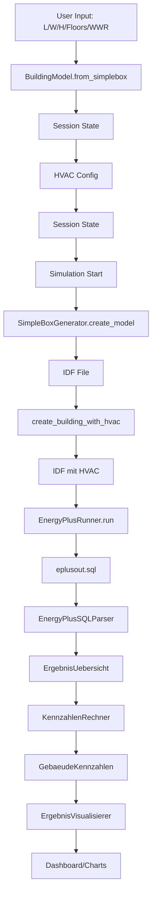
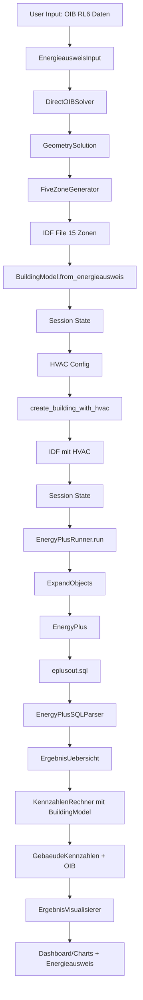

# 04 - Datenfluss Dokumentation

> **Modul:** Vollständiger Datenfluss von Input bis Output
> **Zweck:** Nachvollziehbare Datenströme für beide Workflows
> **Zuletzt aktualisiert:** 2025-11-14

---

## Übersicht

Das System unterstützt **zwei parallele Workflows:**

1. **SimpleBox** - Schnelle parametrische Modelle
2. **Energieausweis/OIB** - Detaillierte 5-Zonen-Modelle nach österreichischem Standard

Beide konvergieren in einem **einheitlichen BuildingModel** und nutzen dieselbe Simulations- und Auswertungs-Pipeline.

---

## Workflow 1: SimpleBox

### 1. User Input (Seite 01_Geometrie.py, Tab 1)

**Input-Widgets:**

```python
Input:
├─ length: 20.0 m
├─ width: 12.0 m
├─ height: 6.0 m
├─ num_floors: 2
├─ window_wall_ratio: 0.3
└─ orientation: 0°
```

**Auto-Berechnungen:**

```python
floor_height = height / num_floors  # 6.0 / 2 = 3.0 m
floor_area = length * width         # 20.0 × 12.0 = 240 m²
total_floor_area = floor_area * num_floors  # 240 × 2 = 480 m²
```

---

### 2. BuildingModel Erstellung

**Funktion:** `BuildingModel.from_simplebox()`

```python
from core.building_model import BuildingModel

building_model = BuildingModel.from_simplebox(
    length=20.0,
    width=12.0,
    height=6.0,
    num_floors=2,
    floor_height=3.0,
    window_wall_ratio=0.3,
    idf_path=None  # Wird später gesetzt
)

# Resultat:
{
    'source': 'simplebox',
    'geometry_summary': {
        'length': 20.0,
        'width': 12.0,
        'height': 6.0,
        'num_floors': 2,
        'floor_height': 3.0,
        'floor_area': 240.0,
        'total_floor_area': 480.0,
        'volume': 1440.0,
        'envelope_area': 576.0,
        'av_ratio': 0.4,
        'window_wall_ratio': 0.3
    },
    'num_zones': 2,  # 1 pro Geschoss
    'has_hvac': False
}
```

---

### 3. Session State Speicherung (Geometrie → HVAC)

```python
st.session_state['building_model'] = building_model.model_dump()
st.session_state['geometry_method'] = 'simplebox'
st.session_state['geometry_valid'] = True
st.session_state['visualization_data'] = {...}
```

**Übergang zu Seite 02_HVAC.py:**

```python
# HVAC-Seite lädt:
building_model = get_building_model_from_session(st.session_state)
# → Zeigt Kontext (SimpleBox, 2 Zonen, 480 m²)
```

---

### 4. HVAC-Konfiguration (Seite 02_HVAC.py)

**Input:**

```python
hvac_config = {
    'heating_system': 'Ideal Loads Air System',
    'heating_enabled': True,
    'heating_setpoint': 20.0,
    'cooling_enabled': True,
    'cooling_setpoint': 26.0,
    'air_change_rate': 0.5
}

st.session_state['hvac_config'] = hvac_config
```

**Für SimpleBox:** HVAC wird NICHT zum IDF hinzugefügt (passiert bei Simulation).

---

### 5. Simulation (Seite 03_Simulation.py)

**IDF-Generierung on-the-fly:**

```python
from features.geometrie.box_generator import SimpleBoxGenerator, BuildingGeometry

# 1. BuildingGeometry erstellen
geometry = BuildingGeometry(
    length=20.0,
    width=12.0,
    height=6.0,
    num_floors=2,
    window_wall_ratio=0.3,
    orientation=0.0
)

# 2. Sim-Settings
sim_settings = {
    'timestep': 4,
    'reporting_frequency': 'Hourly',
    'start_month': 1,
    'start_day': 1,
    'end_month': 12,
    'end_day': 31,
    'output_variables': [...]
}

# 3. IDF erstellen
generator = SimpleBoxGenerator()
idf = generator.create_model(
    geometry=geometry,
    idf_path=output_dir / "building.idf",
    sim_settings=sim_settings
)

# 4. HVAC hinzufügen
from features.hvac.ideal_loads import create_building_with_hvac

idf = create_building_with_hvac(
    idf,
    heating_setpoint=20.0,
    cooling_setpoint=26.0,
    heating_enabled=True,
    cooling_enabled=True
)

# 5. Speichern
idf.save()
```

**EnergyPlus Ausführung:**

```python
from features.simulation.runner import EnergyPlusRunner

runner = EnergyPlusRunner()
result = runner.run_simulation(
    idf_path=str(output_dir / "building.idf"),
    weather_file=str(weather_path),
    output_dir=str(output_dir)
)

# Resultat:
{
    'success': True,
    'idf_path': '.../building.idf',
    'output_dir': '.../simulation_20251114_150000',
    'execution_time': 12.3,
    'sql_file': '.../eplusout.sql',
    'csv_files': [...]
}
```

**Session State:**

```python
st.session_state['simulation_result'] = result.model_dump()
st.session_state['simulation_output_dir'] = str(output_dir)
```

---

### 6. Auswertung (Seite 04_Ergebnisse.py)

**KPI-Berechnung:**

```python
from features.auswertung.kpi_rechner import KennzahlenRechner

# 1. Fläche aus BuildingModel
building_model = get_building_model_from_session(st.session_state)
total_floor_area = building_model.geometry_summary['total_floor_area']  # 480 m²

# 2. HVAC-Typ
hvac_config = st.session_state.get('hvac_config', {})
heating_system = hvac_config.get('heating_system')  # 'Ideal Loads Air System'

# 3. KPI-Rechner
rechner = KennzahlenRechner(
    nettoflaeche_m2=total_floor_area,
    building_model=building_model
)

# 4. Kennzahlen berechnen
kennzahlen = rechner.berechne_kennzahlen(
    sql_file=result.sql_file
)

# Resultat:
GebaeudeKennzahlen {
    energiekennzahl_kwh_m2a: 85.3,
    heizkennzahl_kwh_m2a: 62.1,
    kuehlkennzahl_kwh_m2a: 8.5,
    effizienzklasse: 'B',
    hwb_kwh_m2a: 62.1,
    eeb_kwh_m2a: 70.6,
    peb_kwh_m2a: None,  # Kein HVAC-Typ für Konversion
    thermische_behaglichkeit: 'Gut',
    ...
}
```

**Visualisierung:**

```python
from features.auswertung.visualisierung import ErgebnisVisualisierer

viz = ErgebnisVisualisierer()

# Dashboard
dashboard = viz.erstelle_dashboard(kennzahlen, result.sql_file)
st.plotly_chart(dashboard)

# Temperaturkurve
temp_fig = viz.erstelle_interaktive_temperaturkurve(
    sql_file=result.sql_file,
    start_tag=1,
    anzahl_tage=7
)
st.plotly_chart(temp_fig)
```

---

## Workflow 2: Energieausweis / OIB RL6

### 1. User Input (Seite 01_Geometrie.py, Tab 2)

**Phase 1: OIB-Pflichtangaben**

```python
Input:
├─ gebaeudetyp: 'EFH'
├─ bruttoflaeche: 219.0 m²
├─ bezugsflaeche: 175.0 m²
├─ brutto_volumen: 729.0 m³
├─ huellflaeche_gesamt: 538.0 m²
├─ u_wand: 0.35 W/m²K
├─ u_dach: 0.25 W/m²K
├─ u_boden: 0.45 W/m²K
├─ u_fenster: 1.5 W/m²K
├─ klimaregion: 'Ost' (via PLZ 1010)
├─ heizgradtage: 3400.0 Kd
├─ heiztage: 220
├─ norm_aussentemp: -12.0 °C
└─ fenster:
    ├─ nord_m2: 15.0
    ├─ ost_m2: 20.0
    ├─ sued_m2: 30.0
    └─ west_m2: 15.0
```

**Auto-Berechnungen:**

```python
# Klimadaten-Lookup
from core.climate_data import get_climate_data_by_plz

climate = get_climate_data_by_plz(1010)  # Wien
→ klimaregion: 'Ost'
→ heizgradtage_kd: 3400.0
→ norm_aussentemp_c: -12.0

# OIB-Kennzahlen
kompaktheit = huellflaeche / brutto_volumen  # 538 / 729 = 0.738 m⁻¹
char_laenge = brutto_volumen / huellflaeche  # 729 / 538 = 1.355 m
```

**Phase 2: Geometrie-Erstellung**

```python
Input:
├─ geometrie_modus: 'Automatisch'
├─ anzahl_geschosse: 3
├─ aspect_ratio: 1.8
└─ luftwechsel: 0.6 1/h
```

---

### 2. EnergieausweisInput Erstellung

```python
from features.geometrie.models.energieausweis_input import EnergieausweisInput

ea_input = EnergieausweisInput(
    bruttoflaeche_m2=219.0,
    bezugsflaeche_m2=175.0,
    brutto_volumen_m3=729.0,
    huellflaeche_gesamt_m2=538.0,
    u_wert_wand=0.35,
    u_wert_dach=0.25,
    u_wert_boden=0.45,
    u_wert_fenster=1.5,
    gebaeudetyp='EFH',
    anzahl_geschosse=3,
    geschosshoehe_m=2.7,
    klimaregion='Ost',
    heizgradtage_kd=3400.0,
    heiztage=220,
    norm_aussentemperatur_c=-12.0,
    fenster=FensterData(
        nord_m2=15.0,
        ost_m2=20.0,
        sued_m2=30.0,
        west_m2=15.0
    ),
    luftwechselrate_h=0.6
)

# Validierung
warnings = ea_input.oib_warnings
# → ['A/V-Inkonsistenz: ...'] falls vorhanden
```

---

### 3. Geometrie-Solver

```python
from features.geometrie.utils.geometry_solver import DirectOIBSolver

solver = DirectOIBSolver()
solution = solver.solve(
    ea_input=ea_input,
    manual_length=None,  # Automatisch
    manual_width=None,
    manual_height=None
)

# Resultat:
GeometrySolution {
    length: 11.82 m,
    width: 6.57 m,
    height: 8.1 m,
    floor_height: 2.7 m,
    method: SolverMethod.AUTOMATIC,
    confidence: 0.88,
    warnings: []
}
```

---

### 4. IDF-Generierung

```python
from features.geometrie.generators.five_zone_generator import FiveZoneGenerator

generator = FiveZoneGenerator()
idf, output_path = generator.create_from_energieausweis(
    ea_data=ea_input,
    output_path=output_dir / "building.idf"
)

# Intern (vereinfacht):
# 1. Multi-Floor Layouts (3 Geschosse × 5 Zonen = 15 Zonen)
layouts = PerimeterCalculator.create_multi_floor_layout(
    length=11.82,
    width=6.57,
    height=8.1,
    num_floors=3,
    window_wall_ratio=0.25  # Aus Fensterflächen berechnet
)

# 2. IDF-Komponenten
MetadataGenerator.add_metadata(idf, ea_input)
MaterialsGenerator.add_materials_from_u_values(idf, ea_input)
ZoneGenerator.add_zones(idf, layouts)  # 15 Zonen
SurfaceGenerator.add_all_surfaces(idf, layouts, ea_input)
ScheduleGenerator.add_schedules(idf)
InternalLoadsGenerator.add_loads(idf, layouts, 'EFH')
InfiltrationGenerator.add_infiltration(idf, 0.6)

# 3. Speichern + Bug-Fix
idf.save(output_path)
EppyBugFixer.fix_boundary_objects(output_path)
```

---

### 5. BuildingModel Erstellung

```python
from core.building_model import BuildingModel

building_model = BuildingModel.from_energieausweis(
    geo_solution=solution,
    ea_data=ea_input,
    idf_path=output_path,
    num_zones=15  # 5 × 3
)

# Resultat:
{
    'source': 'oib_energieausweis',
    'geometry_summary': {
        'length': 11.82,
        'width': 6.57,
        'height': 8.1,
        'floor_height': 2.7,
        'num_floors': 3,
        'total_floor_area': 219.0,
        'nettoflaeche_m2': 175.0,

        # OIB-Kennzahlen
        'oib_brutto_grundflaeche': 219.0,
        'oib_bezugsflaeche': 175.0,
        'oib_brutto_volumen': 729.0,
        'oib_huellflaeche_gesamt': 538.0,
        'oib_kompaktheit': 0.738,
        'oib_char_laenge': 1.355,
        'oib_mittlerer_u_wert': 0.52,  # Flächengewichtet
        'oib_klimaregion': 'Ost',
        'oib_heizgradtage': 3400.0,

        # U-Werte
        'u_wand': 0.35,
        'u_dach': 0.25,
        'u_boden': 0.45,
        'u_fenster': 1.5
    },
    'idf_path': '.../building.idf',
    'num_zones': 15,
    'has_hvac': False,
    'gebaeudetyp': 'EFH',
    'energieausweis_data': {
        # Vollständige EA-Daten für YAML-Export
        ...
        '_geometry_solver_meta': {
            'method': 'automatic',
            'confidence': 0.88,
            'calculated_length': 11.82,
            'calculated_width': 6.57,
            'calculated_height': 8.1
        }
    }
}
```

**Session State:**

```python
st.session_state['building_model'] = building_model.model_dump()
st.session_state['idf'] = idf
st.session_state['idf_path'] = str(output_path)
st.session_state['ea_input_oib'] = ea_input.model_dump()
st.session_state['geo_solution_oib'] = solution.model_dump()
st.session_state['geometry_source'] = 'oib_energieausweis'
```

---

### 6. HVAC-Konfiguration (Seite 02_HVAC.py)

**Input:**

```python
hvac_config = {
    'heating_system': 'Wärmepumpe (Luft/Wasser)',  # Für PEB/CO₂!
    'ventilation_system': 'Mechanische Lüftung mit WRG',
    'heating_enabled': True,
    'heating_setpoint': 20.0,
    'cooling_enabled': True,
    'cooling_setpoint': 26.0,
    'air_change_rate': 0.5
}

st.session_state['hvac_config'] = hvac_config
```

**HVAC zum IDF hinzufügen:**

```python
from features.hvac.ideal_loads import create_building_with_hvac
from eppy.modeleditor import IDF

# IDF aus Datei laden
idf_path = st.session_state['idf_path']
idf = IDF(idf_path)

# HVAC hinzufügen (zu allen 15 Zonen)
idf = create_building_with_hvac(
    idf,
    heating_setpoint=20.0,
    cooling_setpoint=26.0,
    heating_enabled=True,
    cooling_enabled=True
)

# Speichern
idf.save()

# BuildingModel aktualisieren
building_model['has_hvac'] = True
st.session_state['building_model'] = building_model
```

---

### 7. Simulation (Seite 03_Simulation.py)

**IDF ist bereits vorhanden!**

```python
# 1. IDF-Pfad aus Session State
idf_path = building_model['idf_path']

# 2. In Output-Verzeichnis kopieren
shutil.copy(idf_path, output_dir / "building.idf")

# 3. EnergyPlus ausführen
runner = EnergyPlusRunner()
result = runner.run_simulation(
    idf_path=str(output_dir / "building.idf"),
    weather_file=str(weather_path),
    output_dir=str(output_dir)
)

# Intern: ExpandObjects wird automatisch erkannt und ausgeführt
# (weil HVACTemplate-Objekte im IDF vorhanden)
```

---

### 8. Auswertung (Seite 04_Ergebnisse.py)

**KPI-Berechnung mit OIB-Metadaten:**

```python
from features.auswertung.kpi_rechner import KennzahlenRechner

# 1. Bezugsfläche (für spezifische Kennzahlen)
building_model = get_building_model_from_session(st.session_state)
nettoflaeche_m2 = building_model.geometry_summary['nettoflaeche_m2']  # 175 m²

# 2. HVAC-Typ (für PEB/CO₂)
hvac_config = st.session_state.get('hvac_config', {})
heating_system = hvac_config.get('heating_system')  # 'Wärmepumpe (Luft/Wasser)'

# 3. KPI-Rechner
rechner = KennzahlenRechner(
    nettoflaeche_m2=nettoflaeche_m2,
    building_model=building_model  # Mit OIB-Metadaten!
)

# 4. Kennzahlen berechnen
kennzahlen = rechner.berechne_kennzahlen(
    sql_file=result.sql_file
)

# Resultat (mit OIB-Kennzahlen):
GebaeudeKennzahlen {
    # Deutsche Kennzahlen
    energiekennzahl_kwh_m2a: 72.5,
    heizkennzahl_kwh_m2a: 48.3,
    kuehlkennzahl_kwh_m2a: 6.2,
    effizienzklasse: 'B',

    # OIB RL6 Kennzahlen
    hwb_kwh_m2a: 48.3,
    heb_kwh_m2a: 48.3,
    wwwb_kwh_m2a: 0.0,  # Nicht simuliert
    eeb_kwh_m2a: 54.5,  # hwb + wwwb + kühl
    peb_kwh_m2a: 24.5,  # eeb × f_PE (0.45 für Wärmepumpe)
    co2_kg_m2a: 9.8,    # eeb × Fläche × f_CO₂
    f_gee: 0.62,
    oib_effizienzklasse: 'A',  # A++ bis G

    # Geometrische Kennzahlen (aus BuildingModel)
    kompaktheit_av: 0.738,
    char_laenge_lc: 1.355,
    mittlerer_u_wert: 0.52,

    # OIB-Wärmebilanz
    transmissionswaermeverluste_kwh: 4567,
    lueftungswaermeverluste_kwh: 2134,
    solare_waermegewinne_kwh: 1823,
    innere_waermegewinne_kwh: 987,

    # Thermischer Komfort
    mittlere_temp_c: 21.3,
    thermische_behaglichkeit: 'Gut',
    ...
}
```

**PEB/CO₂-Berechnung (Details):**

```python
from data.oib_konversionsfaktoren import get_konversionsfaktor_fuer_hvac, berechne_peb, berechne_co2

# 1. Konversionsfaktoren laden
faktor = get_konversionsfaktor_fuer_hvac('Wärmepumpe (Luft/Wasser)')
# → f_PE = 0.45, f_CO₂ = 0.103 kg/kWh

# 2. PEB berechnen
eeb_kwh_m2a = 54.5
peb_kwh_m2a = berechne_peb(eeb_kwh_m2a, 'Wärmepumpe (Luft/Wasser)')
# → 54.5 × 0.45 = 24.5 kWh/m²a

# 3. CO₂ berechnen
co2_kg_m2a = berechne_co2(eeb_kwh_m2a, nettoflaeche_m2, 'Wärmepumpe (Luft/Wasser)')
# → 54.5 × 175 × 0.103 / 175 = 9.8 kg/m²a
```

**OIB-Effizienzklasse (Details):**

```python
# 4 Kriterien prüfen (Tabelle 8):
klasse_hwb = bestimme_klasse_nach_hwb(48.3)  # → 'B' (≤50)
klasse_peb = bestimme_klasse_nach_peb(24.5)  # → 'A++' (≤60) aber besser!
klasse_co2 = bestimme_klasse_nach_co2(9.8)   # → 'A+' (≤10)
klasse_f_gee = bestimme_klasse_nach_f_gee(0.62)  # → 'A' (≤0.70)

# SCHLECHTESTE Klasse gilt (konservativ)
oib_effizienzklasse = max(klasse_hwb, klasse_peb, klasse_co2, klasse_f_gee)
# → 'B' (wegen HWB)
```

---

## Datenfluss-Diagramm

### SimpleBox-Workflow



### Energieausweis-Workflow



---

## Kritische Datentransformationen

### 1. Energieeinheiten

| Quelle | Einheit | Ziel | Einheit | Transformation |
|--------|---------|------|---------|----------------|
| SQL (ReportData) | J | ErgebnisUebersicht | kWh | `÷ 3_600_000` |
| ErgebnisUebersicht | kWh | GebaeudeKennzahlen | kWh/m²a | `÷ nettoflaeche_m2` |

### 2. Leistung

| Quelle | Einheit | Ziel | Einheit | Transformation |
|--------|---------|------|---------|----------------|
| SQL (Rate) | W | ErgebnisUebersicht | kW | `÷ 1000` |
| ErgebnisUebersicht | kW | GebaeudeKennzahlen | W/m² | `× 1000 ÷ nettoflaeche_m2` |

### 3. OIB-Kennzahlen

| Berechnete Kennzahl | Formel | Abhängigkeiten |
|---------------------|--------|----------------|
| HWB | = heizkennzahl | SQL-Heizenergie |
| WWWB | = 0 | Nicht simuliert |
| EEB | = HWB + WWWB + Kühlung | Heiz- und Kühlenergie |
| PEB | = EEB × f_PE | HVAC-Typ! |
| CO₂ | = EEB × Fläche × f_CO₂ | HVAC-Typ! |
| f_GEE | = PEB / Grenzwert | Komplexe Formel |

---

## Daten-Abhängigkeiten

### BuildingModel benötigt für:

- **Auswertung:** `nettoflaeche_m2` für spezifische Kennzahlen
- **OIB-Kennzahlen:** A/V, ℓc, Ū aus `geometry_summary`
- **PEB/CO₂:** `hvac_config['heating_system']` für Konversionsfaktoren

### Session State Keys (Reihenfolge wichtig!)

```
Geometrie-Seite:
├─ building_model ✓
├─ geometry_valid ✓
├─ idf_path (nur 5-Zone) ✓
└─ ea_input_oib (nur OIB) ✓

HVAC-Seite:
├─ hvac_config ✓
└─ building_model['has_hvac'] = True (nur 5-Zone) ✓

Simulation-Seite:
├─ simulation_result ✓
├─ simulation_output_dir ✓
└─ sim_settings ✓

Ergebnisse-Seite:
└─ (liest alle obigen)
```

---

## YAML-Export/Import

### Export-Workflow

```python
from features.web_ui.utils.config_builder import build_simulation_config_from_ui
import yaml

# 1. Config aus Session State erstellen
config = build_simulation_config_from_ui(st.session_state)

# 2. Als YAML serialisieren
yaml_str = yaml.dump(config.model_dump(exclude_none=True))

# 3. Download
st.download_button("Download YAML", data=yaml_str, file_name="scenario.yaml")
```

### Import-Workflow (CLI)

```bash
python scripts/run_from_config.py exported_scenario.yaml
```

```python
# In Script:
from core.simulation_config import SimulationConfig

# 1. YAML laden
config = SimulationConfig.from_yaml("exported_scenario.yaml")

# 2. Workflow basierend auf source
if config.building.source == "simplebox":
    # SimpleBox-Workflow
    ...
else:
    # Energieausweis-Workflow
    ...
```

---

**Letzte Änderung:** 2025-11-14
**Changelog:** Initial creation - Vollständiger Datenfluss dokumentiert
